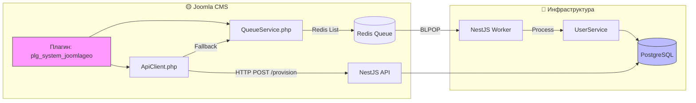

# Техническое задание: Плагин синхронизации пользователей Joomla ↔ NestJS API

**Версия документа:** 1.1  
**Дата:** 2026-04-25  
**Статус:** ✅ Утверждено к реализации  
**Область:** Только синхронизация пользователей (без WebSocket)

---

## 📋 Содержание

1. [Обзор](#-обзор)
2. [Область применения](#-область-применения)
3. [Текущее состояние](#-текущее-состояние)
4. [Целевая архитектура](#-целевая-архитектура)
5. [Требования к компонентам](#-требования-к-компонентам)
6. [Контракт API](#-контракт-api)
7. [Обработка ошибок и устойчивость](#-обработка-ошибок-и-устойчивость)
8. [Сетевая конфигурация](#-сетевая-конфигурация)
9. [План миграции и переименования](#-план-миграции-и-переименования)
10. [Тестирование](#-тестирование)
11. [Критерии приёмки](#-критерии-приёмки)

---

## 🎯 Обзор

### Цель
Разработать отказоустойчивый плагин для Joomla, обеспечивающий **только** синхронизацию данных пользователей с внешним NestJS API:

| ✅ Входит в область | ❌ Не входит в область |
|---------------------|------------------------|
| Автоматическая синхронизация при регистрации | Генерация JWT для WebSocket |
| Асинхронная обработка сбоев через очередь (Redis) | Отображение карт/геоданных |
| Независимость обновлений Joomla от API | Стриминг данных в реальном времени |
| Логирование и мониторинг синхронизации | Аутентификация фронтенда |

> 📌 **Важно**: Генерация токенов для WebSocket-стриминга будет реализована в **отдельном плагине** (`plg_system_userconnect_ws`). Данный плагин отвечает **только** за синхронизацию данных.

### Нефункциональные требования
| Параметр | Значение |
|----------|----------|
| Время ответа при успешной синхронизации | ≤ 500 мс (95-й перцентиль) |
| Максимальная задержка при сбое (очередь) | ≤ 5 минут до первой повторной попытки |
| Доступность синхронизации | ≥ 99.9% (с учётом ретраев) |
| Поддерживаемые версии Joomla | 4.x, 5.x, **6.x** |

---

## 🔍 Текущее состояние

### Реализовано (MVP)
```php
// plg_system_joomlageo/joomlageo.php
public function onUserAfterSave($user, $isNew, $success, $msg): bool {
    if (!$isNew || !$success) return true;
    
    // Синхронный HTTP-запрос без ретраев
    $response = $http->post($apiUrl, $payload, $headers, $timeout);
    
    // Логирование, но не прерывание потока
    Log::add(...);
    return true;
}
```

### Ограничения текущей версии
| Проблема | Риск |
|----------|--------|
| ❌ Нет ретраев при сбоях сети | Потеря синхронизации пользователя |
| ❌ Нет очереди для отложенной отправки | Невосстановимость после простоя API |
| ❌ Жёсткая привязка к названию `joomlageo` | Сложность расширения функционала |
| ❌ Нет поддержки Joomla 6.x | Блокировка обновления платформы |

---

## 🏗 Целевая архитектура



### Структура файлов плагина
```
plugins/system/joomlageo/
├── joomlageo.php              # Точка входа (класс: PlgSystemJoomlageo)
├── joomlageo.xml              # Манифест плагина
├── services/
│   ├── ApiClient.php          # HTTP-клиент с ретраями и фоллбэком
│   └── QueueService.php       # Адаптер для Redis/DB очереди
├── language/
│   ├── en-GB/plg_system_joomlageo.ini
│   └── ru-RU/plg_system_joomlageo.ini
└── config.xml                 # Настройки: API URL, retry policy, queue backend
```

> 📝 **Планируемое переименование**: После стабилизации функционала плагин будет переименован в `plg_system_userconnect` (без привязки к "geo"). Текущая реализация должна учитывать возможность бесшовной миграции.

---

## 🧩 Требования к компонентам

### 1. `ApiClient.php` — HTTP-клиент с устойчивостью

```php
<?php
namespace Joomla\Plugin\System\JoomlaGeo\Services;

use Joomla\CMS\Http\HttpFactory;
use Psr\Log\LoggerInterface;

class ApiClient
{
    public function __construct(
        private string $baseUrl,
        private int $maxRetries = 3,
        private array $retryDelays = [2, 4, 8], // секунды
        private LoggerInterface $logger,
        private QueueService $queue
    ) {}

    /**
     * Отправка данных пользователя с ретраями и фоллбэком на очередь
     * @return bool true если успешно ИЛИ поставлено в очередь
     */
    public function provisionUser(int $userId, array $data): bool
    {
        $lastError = null;
        
        for ($attempt = 0; $attempt <= $this->maxRetries; $attempt++) {
            try {
                // Экспоненциальная задержка перед повторной попыткой (кроме первой)
                if ($attempt > 0) {
                    usleep($this->retryDelays[$attempt - 1] * 1_000_000);
                }

                $response = $this->httpPost('/users/provision', [
                    'joomlaUserId' => $userId,
                    'email' => $data['email'],
                    'username' => $data['username'],
                ], timeout: $this->retryDelays[0]);

                if ($response->code >= 200 && $response->code < 300) {
                    $this->logger->info("User {$userId} provisioned (attempt {$attempt})");
                    return true;
                }
                
                $lastError = new \Exception("HTTP {$response->code}");
                
            } catch (\Throwable $e) {
                $lastError = $e;
                // Продолжаем цикл для следующей попытки
            }
        }

        // Все ретраи исчерпаны → фоллбэк на очередь
        $this->logger->warning("User {$userId} provision failed, queuing for retry", [
            'error' => $lastError?->getMessage(),
            'attempts' => $this->maxRetries + 1
        ]);

        return $this->queue->push('user.provision', [
            'userId' => $userId,
            'data' => $data,
            'attempts' => 0,
            'nextTry' => time() + 60,
            'createdAt' => time(),
        ]);
    }

    private function httpPost(string $path, array $payload, int $timeout): \Joomla\CMS\Http\Response
    {
        $http = HttpFactory::getHttp();
        return $http->post(
            $this->baseUrl . $path,
            json_encode($payload),
            ['Content-Type' => 'application/json'],
            $timeout
        );
    }
}
```

**Требования:**
- [ ] Поддержка экспоненциальной задержки ретраев (настраивается в `config.xml`)
- [ ] Логирование каждой попытки с уровнем `debug`/`warning`
- [ ] Фоллбэк на `QueueService` при исчерпании ретраев
- [ ] Идемпотентность: повторные вызовы с теми же данными не создают дубликаты
- [ ] Таймаут на один запрос: настраивается (по умолчанию 2–5 сек)

---

### 2. `QueueService.php` — Адаптер очереди

```php
<?php
namespace Joomla\Plugin\System\JoomlaGeo\Services;

interface QueueAdapterInterface
{
    public function push(string $queue, array $payload): bool;
    public function getStats(string $queue): array;
}

class RedisQueueAdapter implements QueueAdapterInterface
{
    public function __construct(
        private \Redis $redis,
        private string $prefix = 'uc:'
    ) {}

    public function push(string $queue, array $payload): bool
    {
        $key = $this->prefix . 'queue:' . $queue;
        return $this->redis->lPush($key, json_encode($payload)) !== false;
    }

    public function getStats(string $queue): array
    {
        $key = $this->prefix . 'queue:' . $queue;
        return ['length' => $this->redis->lLen($key)];
    }
}

// Fallback-адаптер на таблицу БД (если Redis недоступен)
class DatabaseQueueAdapter implements QueueAdapterInterface
{
    public function __construct(private \Joomla\Database\DatabaseDriver $db) {}

    public function push(string $queue, array $payload): bool
    {
        // INSERT INTO #__joomlageo_queue (queue, payload, attempts, next_try)
        $query = $this->db->getQuery(true)
            ->insert($this->db->quoteName('#__joomlageo_queue'))
            ->columns([
                $this->db->quoteName('queue'),
                $this->db->quoteName('payload'),
                $this->db->quoteName('attempts'),
                $this->db->quoteName('next_try'),
                $this->db->quoteName('created_at')
            ])
            ->values(implode(', ', [
                $this->db->quote($queue),
                $this->db->quote(json_encode($payload)),
                '0',
                $this->db->quote(time() + 60),
                $this->db->quote(time())
            ]));
        
        return $this->db->setQuery($query)->execute();
    }

    public function getStats(string $queue): array
    {
        $query = $this->db->getQuery(true)
            ->select('COUNT(*)')
            ->from($this->db->quoteName('#__joomlageo_queue'))
            ->where($this->db->quoteName('queue') . ' = :queue')
            ->bind(':queue', $queue);
        
        return ['length' => (int) $this->db->setQuery($query)->loadResult()];
    }
}

class QueueService
{
    public function __construct(private QueueAdapterInterface $adapter) {}

    public function push(string $queue, array $payload): bool
    {
        try {
            return $this->adapter->push($queue, $payload);
        } catch (\Throwable $e) {
            // Последняя попытка: логирование и тихий фоллбэк
            error_log("JoomlaGeo queue failed: " . $e->getMessage());
            return false; // но не прерываем поток пользователя!
        }
    }
}
```

**Требования:**
- [ ] Интерфейс `QueueAdapterInterface` для поддержки разных бэкендов
- [ ] Приоритет: Redis → Database (fallback)
- [ ] Структура сообщения очереди включает: `userId`, `data`, `attempts`, `nextTry`, `createdAt`
- [ ] Метод `getStats()` для мониторинга в админке Joomla
- [ ] Таблица очереди создаётся автоматически при установке плагина (через `install.sql`)

---

### 3. `config.xml` — Настройки плагина

```xml
<?xml version="1.0" encoding="utf-8"?>
<config>
    <fieldset name="basic" label="PLG_SYSTEM_JOOMLAGEO_BASIC">
        <field name="api_url" type="url" 
               default="http://joomla-api:3000/api/v1/users"
               label="PLG_SYSTEM_JOOMLAGEO_API_URL_LABEL"
               description="PLG_SYSTEM_JOOMLAGEO_API_URL_DESC"
               required="true" />
        
        <field name="queue_backend" type="list" 
               default="redis"
               label="PLG_SYSTEM_JOOMLAGEO_QUEUE_BACKEND_LABEL">
            <option value="redis">Redis (рекомендуется)</option>
            <option value="database">Database (fallback)</option>
        </field>
        
        <field name="redis_host" type="text" 
               default="redis"
               label="PLG_SYSTEM_JOOMLAGEO_REDIS_HOST_LABEL"
               description="PLG_SYSTEM_JOOMLAGEO_REDIS_HOST_DESC"
               showon="queue_backend:redis" />
        
        <field name="redis_port" type="number" 
               default="6379"
               label="PLG_SYSTEM_JOOMLAGEO_REDIS_PORT_LABEL"
               showon="queue_backend:redis" />
    </fieldset>
    
    <fieldset name="advanced" label="PLG_SYSTEM_JOOMLAGEO_ADVANCED">
        <field name="max_retries" type="number" 
               default="3" min="0" max="10"
               label="PLG_SYSTEM_JOOMLAGEO_MAX_RETRIES_LABEL" />
        
        <field name="retry_delays" type="text" 
               default="2,4,8"
               label="PLG_SYSTEM_JOOMLAGEO_RETRY_DELAYS_LABEL"
               description="PLG_SYSTEM_JOOMLAGEO_RETRY_DELAYS_DESC"
               hint="2,4,8" />
        
        <field name="request_timeout" type="number" 
               default="3" min="1" max="30"
               label="PLG_SYSTEM_JOOMLAGEO_TIMEOUT_LABEL"
               description="PLG_SYSTEM_JOOMLAGEO_TIMEOUT_DESC" />
        
        <field name="log_level" type="list" 
               default="warning"
               label="PLG_SYSTEM_JOOMLAGEO_LOG_LEVEL_LABEL">
            <option value="debug">Debug</option>
            <option value="info">Info</option>
            <option value="warning">Warning</option>
            <option value="error">Error</option>
        </field>
    </fieldset>
</config>
```

---

## 🔗 Контракт API

### NestJS: `POST /api/v1/users/provision`

**Request:**
```json
{
  "joomlaUserId": 123,
  "email": "user@example.com",
  "username": "alice"
}
```

**Response (201 Created):**
```json
{
  "success": true,
  "joomlaUserId": 123,
  "synced": true
}
```

**Response (400 Bad Request):**
```json
{
  "statusCode": 400,
  "message": "Validation failed: email is not valid"
}
```

**Идемпотентность:**  
Повторные запросы с тем же `joomlaUserId` должны выполнять `UPSERT`, а не создавать дубликаты:
```sql
INSERT INTO public.app_users (joomla_id, email, username, ...)
VALUES ($1, $2, $3, ...)
ON CONFLICT (joomla_id) DO UPDATE SET
  email = EXCLUDED.email,
  username = EXCLUDED.username,
  last_synced_at = NOW();
```

---

## 🛡 Обработка ошибок и устойчивость

### Стратегия ретраев (ApiClient)
```
Попытка 0: немедленно, таймаут = request_timeout
Попытка 1: +2с задержка, таймаут = request_timeout  
Попытка 2: +4с задержка, таймаут = request_timeout
Попытка 3: +8с задержка, таймаут = request_timeout → если не удалось → очередь
```

### Очередь: структура сообщения
```json
{
  "id": "uuid-v4",
  "queue": "user.provision",
  "payload": {
    "userId": 123,
    "data": { "email": "...", "username": "..." }
  },
  "attempts": 0,
  "maxAttempts": 5,
  "nextTry": 1714051200,
  "createdAt": 1714051140,
  "lastError": null
}
```

### Воркер NestJS: обработка очереди
```ts
@Processor('user-events')
export class UserEventsWorker {
  @Process('user.provision')
  async handleProvision(job: Job<UserProvisionPayload>) {
    try {
      await this.userService.provisionUser(job.data);
      return { success: true };
    } catch (err) {
      // Экспоненциальная задержка для следующей попытки
      const nextDelay = Math.min(1000 * 2 ** job.attempts, 300_000); // макс 5 минут
      throw new Error(`Retry in ${nextDelay}ms: ${err.message}`);
    }
  }
}
```

---

## 🌐 Сетевая конфигурация

### Вопрос: Обязательно ли использовать внутреннюю Docker-сеть?

**Ответ: Нет, не обязательно.** Плагин поддерживает оба сценария:

| Сценарий | Конфигурация `api_url` | Требования | Риски |
|----------|------------------------|------------|-------|
| **Внутренняя Docker-сеть** (рекомендуется) | `http://joomla-api:3000/api/v1/users` | • Сервисы в одном `docker-compose`<br>• Общая сеть | • Только для локальной разработки или приватного кластера |
| **Внешний публичный URL** | `https://api.example.com/api/v1/users` | • API доступен извне<br>• HTTPS обязателен<br>• Firewall настроен | • Задержки сети<br>• Необходимость аутентификации запросов (см. ниже) |

### 🔐 Защита запросов при использовании внешнего URL

Если `api_url` указывает на публичный эндпоинт, **обязательно** включить проверку подписи запросов:

```php
// В ApiClient.php при отправке:
$timestamp = time();
$signature = hash_hmac('sha256', json_encode($payload) . $timestamp, $sharedSecret);

$headers = [
    'Content-Type' => 'application/json',
    'X-UC-Signature' => $signature,
    'X-UC-Timestamp' => (string) $timestamp,
];
```

```ts
// NestJS: InternalApiGuard для проверки подписи
export class InternalApiGuard implements CanActivate {
  canActivate(context: ExecutionContext): boolean {
    const request = context.switchToHttp().getRequest();
    const signature = request.headers['x-uc-signature'];
    const timestamp = request.headers['x-uc-timestamp'];
    
    // Проверка freshness (≤ 5 минут)
    if (Math.abs(Date.now() - parseInt(timestamp)) > 5 * 60 * 1000) {
      return false;
    }
    
    // Проверка HMAC
    const expected = crypto
      .createHmac('sha256', process.env.USERCONNECT_SHARED_SECRET)
      .update(JSON.stringify(request.body) + timestamp)
      .digest('hex');
    
    return crypto.timingSafeEqual(
      Buffer.from(signature),
      Buffer.from(expected)
    );
  }
}
```

> 📌 **Рекомендация**: Для локальной разработки использовать внутреннюю Docker-сеть без подписи. Для продакшена — внешний HTTPS-URL + HMAC-подпись.

---

## 🔄 План миграции и переименования

### Этап 1: Подготовка (неделя 1)
- [ ] Добавить поддержку Joomla 6.x в `joomlageo.xml` (`<joomla>` → `<joomla3>`, `<joomla4>`, `<joomla5>`, `<joomla6>`)
- [ ] Создать `install.sql` с таблицей очереди `#__joomlageo_queue`
- [ ] Добавить языковые строки в `language/*/plg_system_joomlageo.ini`

### Этап 2: Рефакторинг (неделя 2)
- [ ] Выделить `ApiClient` и `QueueService` в отдельные классы
- [ ] Реализовать интерфейс очереди с адаптерами (Redis/DB)
- [ ] Добавить настройку `retry_delays` и `request_timeout` в `config.xml`

### Этап 3: Тестирование (неделя 3)
- [ ] Юнит-тесты для сервисов (PHPUnit)
- [ ] Интеграционный тест: регистрация → провижининг → очередь → успешная синхронизация
- [ ] Тест совместимости с Joomla 6.x (на staging-окружении)

### Этап 4: Подготовка к переименованию (неделя 4)
- [ ] Создать новую директорию `plugins/system/userconnect/` как "placeholder"
- [ ] Документировать шаги миграции: `joomlageo` → `userconnect`
- [ ] Добавить предупреждение в админку: *"Плагин будет переименован в следующей мажорной версии"*

### Обратная совместимость
- Старое имя `joomlageo` остаётся рабочим до следующего мажорного релиза
- Настройки хранятся в `#__extensions` по `element = 'joomlageo'` — при переименовании потребуется миграция записи
- Все новые функции реализуются в текущей структуре, чтобы не блокировать разработку

---

## 🧪 Тестирование

### Юнит-тесты (PHPUnit)
```php
// tests/Unit/Services/ApiClientTest.php
public function testProvisionUserWithRetrySuccess()
{
    $mockHttp = $this->createMock(Http::class);
    $mockHttp->expects($this->once())
             ->method('post')
             ->willReturn((object)['code' => 201]);
    
    $client = new ApiClient('http://test', 3, [1,2,4], $logger, $queue);
    $this->assertTrue($client->provisionUser(123, ['email' => 'a@b.c']));
}

public function testProvisionUserFallbackToQueue()
{
    // ... проверка, что после 3 неудач вызывается QueueService::push()
}
```

### Интеграционный тест (Docker + Codeception)
```php
// tests/Integration/UserProvisioningCest.php
public function testUserRegistrationTriggersProvisioning(AcceptanceTester $I)
{
    $I->amOnPage('/administrator/index.php?option=com_users&task=user.add');
    $I->fillField(['name' => 'name'], 'Test User');
    $I->fillField(['name' => 'email'], 'test@example.com');
    $I->click('Save & Close');
    
    // Проверка БД (если есть доступ)
    $I->seeInDatabase('app_users', ['joomla_id' => $newUserId]);
    
    // Проверка логов
    $I->seeLogMessageContains('User provisioned successfully', 'joomlageo');
}
```

### Тест устойчивости (симуляция сбоя API)
```php
public function testProvisioningWithApiDowntime()
{
    // 1. Остановить NestJS API
    // 2. Зарегистрировать пользователя
    // 3. Убедиться, что запись появилась в очереди
    // 4. Запустить API
    // 5. Запустить воркер
    // 6. Убедиться, что запись синхронизирована
}
```

---

## ✅ Критерии приёмки

### Функциональные
- [ ] Регистрация пользователя в Joomla создаёт запись в `public.app_users` ≤ 2 сек (в 95% случаев)
- [ ] При недоступности API данные ставятся в очередь и синхронизируются после восстановления
- [ ] Плагин корректно работает на Joomla 4.x, 5.x и **6.x**
- [ ] Настройка `api_url` принимает как внутренние (`http://joomla-api:3000`), так и внешние (`https://...`) URL

### Нефункциональные
- [ ] Отсутствие блокирующих операций в `onUserAfterSave` (время выполнения ≤ 500 мс)
- [ ] Логирование всех критических событий с возможностью фильтрации по уровню
- [ ] Конфигурация всех параметров через админку, без правки кода
- [ ] Документация: `README.md` с примерами установки и настройки

### Безопасность
- [ ] Секреты не попадают в логи или ответы API
- [ ] При использовании внешнего `api_url` поддерживается проверка подписи запросов (HMAC-SHA256)
- [ ] Очередь защищена от подделки сообщений (валидация структуры при чтении)

---

## 📎 Приложения

### Приложение А: Пример `install.sql`
```sql
-- plugins/system/joomlageo/install.sql
CREATE TABLE IF NOT EXISTS #__joomlageo_queue (
    id BIGINT UNSIGNED AUTO_INCREMENT PRIMARY KEY,
    queue VARCHAR(64) NOT NULL,
    payload JSON NOT NULL,
    attempts TINYINT UNSIGNED DEFAULT 0,
    max_attempts TINYINT UNSIGNED DEFAULT 5,
    next_try INT UNSIGNED NOT NULL,
    created_at INT UNSIGNED NOT NULL,
    last_error TEXT,
    INDEX idx_queue_next_try (queue, next_try),
    INDEX idx_created_at (created_at)
) ENGINE=InnoDB DEFAULT CHARSET=utf8mb4 COLLATE=utf8mb4_unicode_ci;
```

### Приложение Б: Чеклист перед релизом
- [ ] Все зависимости указаны в `joomlageo.xml` (`<dependencies>`)
- [ ] Языковые строки добавлены в `language/*/plg_system_joomlageo.ini`
- [ ] Пройдены юнит- и интеграционные тесты
- [ ] Протестирована работа с Redis и Database-очередью
- [ ] Документация обновлена (README, CHANGELOG)
- [ ] Подготовлен план миграции на `userconnect`

---

> 📌 **Примечание для разработчиков**:  
> При реализации придерживайтесь принципа «не навреди»: ни при каких обстоятельствах сбой плагина не должен прерывать регистрацию пользователя в Joomla. Все ошибки — в лог, все сценарии сбоев — в очередь.  
>   
> **Генерация токенов для WebSocket — отдельная задача**. Не добавляйте в этот плагин функционал, не указанный в данном ТЗ.

*Документ подготовлен для включения в репозиторий документации проекта.*